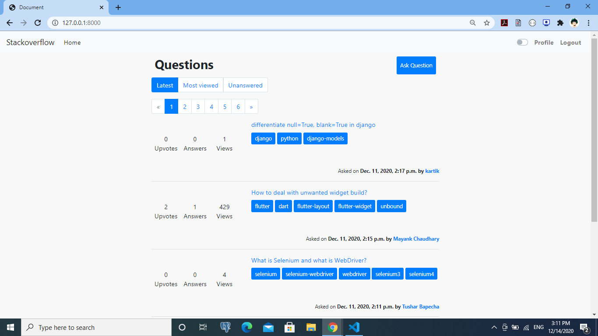
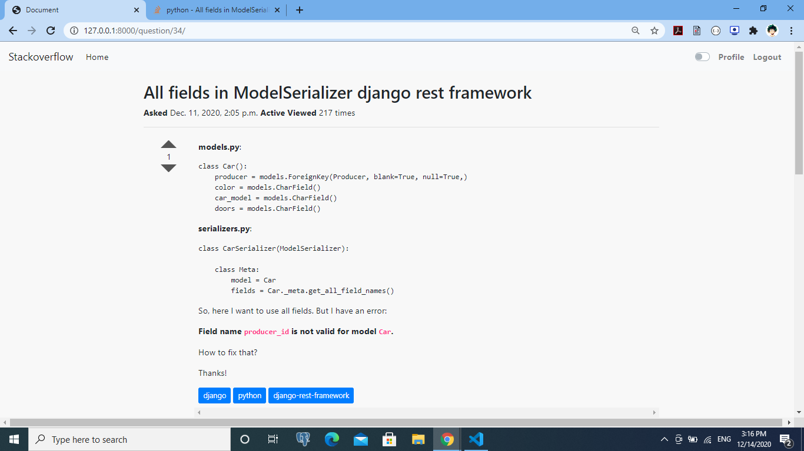
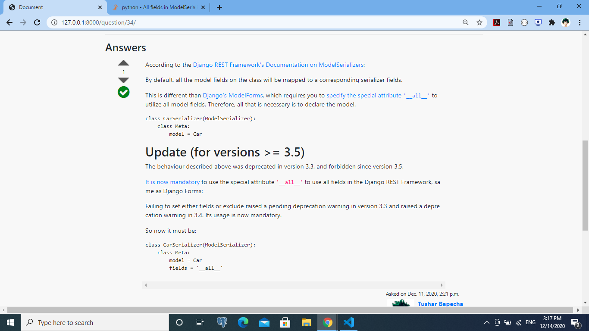
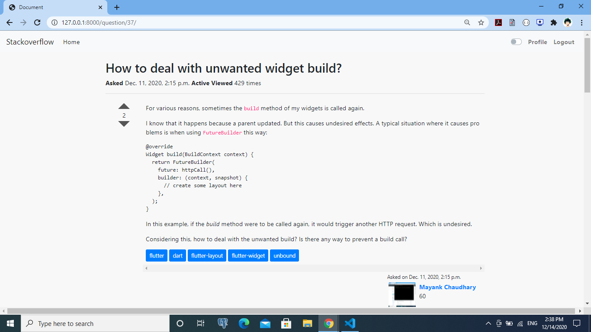
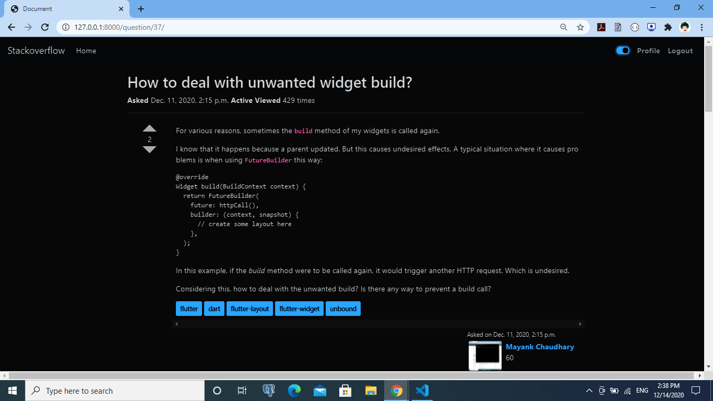
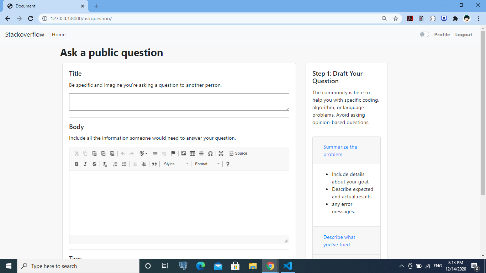
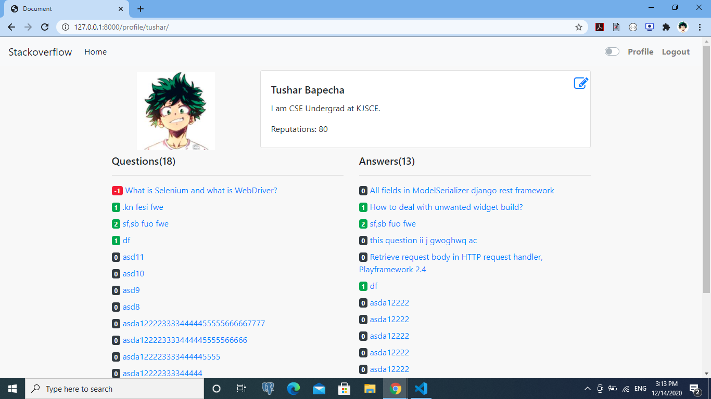
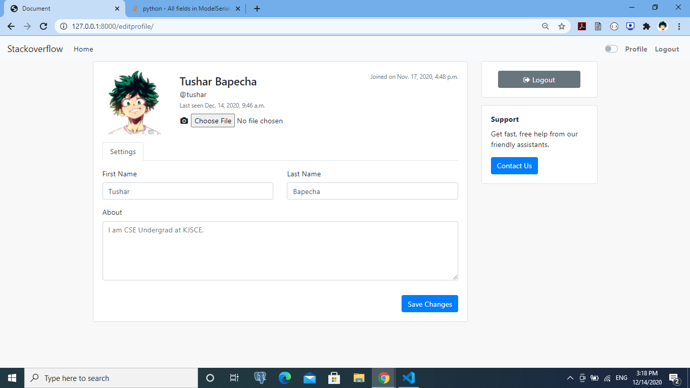

<p align="center"

</p>

<h1 align = 'center'> StackOverflow Clone
</h1>

&emsp;&emsp;&emsp;&emsp;&emsp;&emsp;[](https://www.djangoproject.com/) 
&emsp;
[](https://docs.python.org/2/library/sqlite3.html)
&emsp;
[](https://code.visualstudio.com/ "Visual Studio Code")


<h2 align='center'> About </h2>
<p align='center'>
The aim of the project is to implement all the basic and necesssary functionalities of <a href="http://stackoverflow.com/">Stackoverflow</a>.
   <br><br>
   <b>For developers, by developers</b>
   <br><br>
Stack Overflow is an open community for anyone that codes. They help you get answers to your toughest coding questions, share knowledge with your coworkers in private, and find your next dream job.
</p>

-----------------------------------

### Preview

<p align="center">

</p>


-----------------------------------

### Question-Accepted answer
<p align="center">

</p>
<p align="center">

</p>


-----------------------------------

### LightMode-Darkmode
<p align="center">

</p>
<p align="center">

</p>


-----------------------------------

### Ask Question
<p align="center">

</p>


-----------------------------------

### Profile-Edit Profile
<p align="center">

</p>
<p align="center">

</p>


-----------------------------------

### 🚀 Features

<p align="left">
   <ul>
      <li>Ask question</li>
      <li>Answer question</li>
      <li>Upvote/Downvote question/Answer</li>
      <li>Profile</li>
      <li>Dark mode</li>
      <li>User reputation</li>
      <li>✅ for accepted answers</li>
      <li>Filters - tags,title,views,answered/unanswered,latest</li>
   </ul>
</p>


-----------------------------------
###             💻 Tech stack
`Backend` : Django <br>
`Database` : SQLite <br>
`Frontend` : CSS, HTML, Bootstrap, jQuery  <br>

-----------------------------------

### :guide_dog: Installation Guide

A step by step series of examples that tell you how to get a development env running

In your cmd:

```
https://github.com/RugvedB/Stackoverflow-Clone
```

Then,

```
cd Stackoverflow-Clone
pip install -r requirements.txt
python manage.py makemigrations
python manage.py migrate
```

Next


Create a .env file, enter your credentials for following fields

```
EMAIL_HOST = ENTER YOUR EMAIL HOST
EMAIL_PORT = ENTER YOUR EMAIL PORT
EMAIL_HOST_USER = ENTER YOUR EMAIL ID
DEFAULT_FROM_EMAIL = ENTER YOUR EMAIL ID
EMAIL_HOST_PASSWORD = ENTER YOUR EMAIL PASSWORD
SECRET_KEY = ENTER YOUR SECRET_KEY
```
Then

```
python manage.py runserver
```

You are done with the setup now!

------------------------------------------

### 📝 To-do List

- [ ] Use ajax for improving user experience. 
- [ ] Add search bar for user,questions,tags etc.
- [ ] Create App for the same. 

------------------------------------------


### :page_with_curl: Acknowledgements & References

- Django Documentation - https://docs.djangoproject.com/en/3.1/
- Stackoverflow - http://stackoverflow.com/
- Javascript - https://developer.mozilla.org/en-US/docs/Web/JavaScript

-----------------------------------

<h3 align="center"><b>Developed with :heart: by <a href="https://github.com/tushargithub44">Tushar</a> and <a href="https://github.com/RugvedB">Rugved</a> </b></h1>
